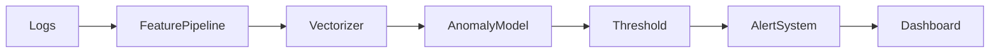

# AI Incident Detection Platform

ML-based anomaly detection system for operational logs.

## Architecture

```mermaid
flowchart LR

Logs --> FeaturePipeline
FeaturePipeline --> Vectorizer
Vectorizer --> AnomalyModel
AnomalyModel --> Threshold
Threshold --> AlertSystem
AlertSystem --> Dashboard
```

---

# License

MIT License
