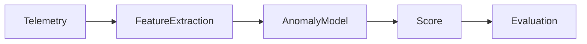

# AI Incident Detection Platform

Operational anomaly detection service for scoring telemetry events using
domain-specific features and a lightweight z-score anomaly model.

## Pipeline



## API

- `GET /health`
- `GET /metrics`
- `GET /events` protected when `API_KEY` is set
- `POST /score`

Example:

```json
{
  "service": "checkout",
  "latency_ms": 900,
  "error_count": 20,
  "timeout_count": 6,
  "traffic_rpm": 2300
}
```

Set `API_KEY` to require `X-API-Key` on scoring/event endpoints.
Set `APP_DB_PATH` to control the SQLite event database location.

## Run

```bash
pip install -r requirements.txt
python -m pytest -q
python evaluation/evaluate.py
uvicorn api.server:app --reload --port 8000
```

Docker:

```bash
cp .env.example .env
docker compose up --build
```

Kubernetes manifests live in `k8s/deployment.yaml` and include probes, resource
limits, a Service, and a PVC for the SQLite event store.

## Highlights

- Telemetry features for latency, errors, timeouts, and traffic.
- Synthetic labeled time-series generator.
- Fitted baseline anomaly model.
- Evaluation script over bundled labeled sample data.
- SQLite event audit trail for score results.
- GitHub Actions CI for tests, eval, and container build.
- Production data contract in `datasets/production_schema.json`.

## License

MIT
