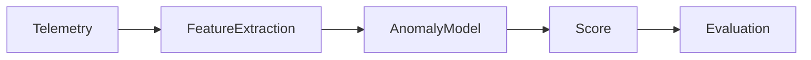

# AI Incident Detection Platform

Operational anomaly detection service for scoring telemetry events using
domain-specific features and a lightweight z-score anomaly model.

## Pipeline



## API

- `GET /health`
- `POST /score`

Example:

```json
{
  "service": "checkout",
  "latency_ms": 900,
  "error_count": 20,
  "timeout_count": 6,
  "traffic_rpm": 2300
}
```

## Run

```bash
pip install -r requirements.txt
python -m pytest -q
python evaluation/evaluate.py
uvicorn api.server:app --reload --port 8000
```

## Highlights

- Telemetry features for latency, errors, timeouts, and traffic.
- Synthetic labeled time-series generator.
- Fitted baseline anomaly model.
- Evaluation script over bundled labeled sample data.

## License

MIT
