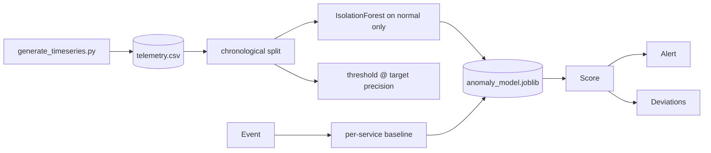

# AI Incident Detection Platform

Operational anomaly detection for service telemetry. An `IsolationForest`
**fitted on normal traffic** scores each minute of per-service metrics against
that service's own healthy baseline, and alerts on a threshold calibrated to an
explicit precision target.

> **Training data is synthetic.** It is generated by
> `training/generate_timeseries.py` (seeded and reproducible), not collected from
> real production systems. The metrics below are real measurements on a held-out
> time window, but the detector has never been validated against real incidents.

## Model

| | |
|---|---|
| Type | `IsolationForest`, 300 trees, fitted on **normal training minutes only** |
| Supervision | Unsupervised. Labels calibrate the threshold and evaluate — they do not fit the model |
| Split | **Chronological per service**: 70% train / 15% validation / 15% test |
| Baseline handling | Per-service mean and std from normal training data |
| Data | 40,320 minutes across 4 services, 93 incidents, 3.5% anomalous |

### Why the split is chronological

Incidents span consecutive minutes. A random split puts minutes 5–8 of an episode
in train and minutes 9–12 in test, so the model "detects" incidents whose middle
it has already seen and every number is inflated. Splitting by time is the only
valid option, and it is enforced in `training/train.py:chronological_split`.

### Held-out results (final 6,048 minutes, 17 incidents, 4.20% anomalous)

| Metric | IsolationForest | z-score baseline |
|---|---|---|
| Precision | **0.7895** | 0.5538 |
| Recall (point-level) | 0.8268 | 0.8504 |
| F1 | **0.8077** | 0.6708 |
| PR-AUC | 0.8523 | **0.8597** |
| Episode recall | 1.0 (17/17) | 1.0 (17/17) |
| Median detection latency | 1 min | 1 min |
| Alerts per hour | **2.639** | 3.869 |

**Read this honestly.** The fitted model does **not** catch more incidents than the
simple z-score baseline — both find all 17, both within a minute. The baseline even
edges it on PR-AUC. The fitted model's real advantage is at the operating point:
**32% fewer alerts per hour for identical incident coverage**, which is the
difference between a pager people act on and one they mute.

That is a smaller claim than "ML beats the baseline", and it is the one the data
supports. `tests/test_model_quality.py` asserts precision and alert volume
specifically, and deliberately does *not* assert a PR-AUC win.

**Accuracy is not reported anywhere.** At a 4.2% base rate, predicting "healthy"
every minute scores 95.8% and detects nothing.

Full details and limitations: [`models/artifacts/model_card.md`](models/artifacts/model_card.md).

## Pipeline



## API

- `GET /health` — status plus the identity of the loaded detector
- `GET /metrics`
- `GET /events` protected when `API_KEY` is set
- `POST /score`

Example request:

```json
{
  "service": "checkout",
  "latency_ms": 620,
  "error_count": 18,
  "timeout_count": 6,
  "traffic_rpm": 1150,
  "cpu_percent": 78,
  "memory_percent": 70
}
```

`cpu_percent` and `memory_percent` are optional and are part of
`datasets/production_schema.json`. Omitted values fall back to typical idle
levels rather than zero, because a genuine 0% CPU reading is itself anomalous.

Set `API_KEY` to require `X-API-Key` on scoring/event endpoints.
Set `APP_DB_PATH` to control the SQLite event database location.

## Run

```bash
pip install -r requirements.txt
python -m pytest -q
python evaluation/evaluate.py
uvicorn api.server:app --reload --port 8000
```

The fitted artifact is committed, so the service runs on a fresh clone. To
regenerate from scratch:

```bash
python training/generate_timeseries.py
python training/train.py
```

To confirm the committed telemetry and detector are reproducible rather than
taking them on trust — this is what CI runs:

```bash
python training/generate_timeseries.py --check
python training/train.py --verify
```

With the server running, use a second terminal for the smoke check:

```bash
python scripts/smoke_test.py
```

Docker:

```bash
cp .env.example .env
docker compose up --build
```

Kubernetes manifests live in `k8s/deployment.yaml` and include probes, resource
limits, a Service, and a PVC for the SQLite event store. The default manifest
uses one replica because SQLite is the default event store.

## Reviewer Status

**What is real and independently checkable:**

- An `IsolationForest` genuinely fitted on normal traffic. The service loads that
  artifact; there are no hardcoded constants in the scoring path.
- Chronological splitting, enforced in code, so no episode leaks across the boundary.
- The alerting threshold is calibrated on a validation window against a stated
  precision target — not chosen by eye.
- Rare-event metrics (precision, recall, PR-AUC, episode recall, detection latency,
  alerts/hour) rather than accuracy.
- A z-score baseline reported side by side, including where it wins.
- Telemetry and training run reproducible, verified in CI on every push.

**What is explicitly not real:**

- **The data is synthetic.** No production telemetry, no real incidents.
- Point-in-time scoring only: each minute is judged independently, with no rolling
  window or trend features, so a slow drift that never produces an unusual single
  minute is missed.
- Per-service baselines are frozen at training time; a legitimate capacity change
  would read as drift until refitting.
- `severity` is generated and stored but never predicted.
- No alert routing, deduplication, or incident lifecycle management.
- The SQLite event store is an audit trail for demos, not a production system.
- Docker/Compose/Kubernetes config is validated by static inspection and CI image
  builds; **cloud deployment is pending and unverified**.

**Quickstart:** run tests and eval, start `uvicorn api.server:app --reload --port 8000`,
then run `python scripts/smoke_test.py`.

**Shared scaffolding:** this service's HTTP hardening (`utils/security.py`), event
store (`utils/storage.py`), and metrics surface follow a common service template
shared with the other Python services in this portfolio. That is deliberate reuse,
not independent implementations.

**Portfolio index:** https://github.com/Adityansh-Chand/ai-engineering-portfolio

## Highlights

- Fitted unsupervised detector serving from a committed artifact.
- Chronological splitting that makes the reported numbers trustworthy.
- Threshold calibrated to an explicit, tunable operational precision target.
- Episode-level metrics and detection latency, not just point-level scores.
- Honest baseline comparison that reports where the baseline wins.
- Generator producing multi-minute correlated incidents plus benign traffic
  spikes as hard negatives.
- Quality gate in CI asserting precision and alert volume.
- Production data contract in `datasets/production_schema.json`.

## License

MIT
