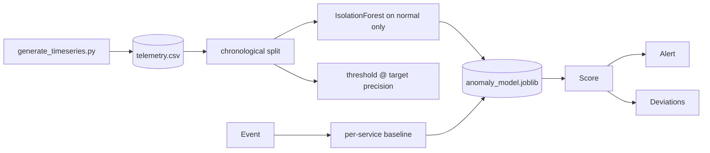

# AI Incident Detection Platform

Operational anomaly detection for service telemetry. An `IsolationForest`
**fitted on normal traffic** scores each minute of per-service metrics against
that service's own healthy baseline, and alerts on a threshold calibrated to an
explicit precision target.

> **The served detector is trained on synthetic data**, generated by
> `training/generate_timeseries.py` (seeded and reproducible), not collected from
> real production systems. Those metrics are real measurements on a held-out time
> window.
>
> **The same approach is separately validated on real telemetry** — five weeks
> from real servers, with anomalies labelled by operators from actual incident
> reports. **It performs badly there, losing to a three-line baseline.** That
> result is published rather than tuned away: see
> [Validation on real data](#validation-on-real-data).

## Model

| | |
|---|---|
| Type | `IsolationForest`, 300 trees, fitted on **normal training minutes only** |
| Supervision | Unsupervised. Labels calibrate the threshold and evaluate — they do not fit the model |
| Split | **Chronological per service**: 70% train / 15% validation / 15% test |
| Baseline handling | Per-service mean and std from normal training data |
| Data | 40,320 minutes across 4 services, 93 incidents, 3.5% anomalous |

### Why the split is chronological

Incidents span consecutive minutes. A random split puts minutes 5–8 of an episode
in train and minutes 9–12 in test, so the model "detects" incidents whose middle
it has already seen and every number is inflated. Splitting by time is the only
valid option, and it is enforced in `training/train.py:chronological_split`.

### Held-out results (final 6,048 minutes, 17 incidents, 4.20% anomalous)

| Metric | IsolationForest | z-score baseline |
|---|---|---|
| Precision | **0.7895** | 0.5538 |
| Recall (point-level) | 0.8268 | 0.8504 |
| F1 | **0.8077** | 0.6708 |
| PR-AUC | 0.8523 | **0.8597** |
| Episode recall | 1.0 (17/17) | 1.0 (17/17) |
| Median detection latency | 1 min | 1 min |
| Alerts per hour | **2.639** | 3.869 |

**Read this honestly.** The fitted model does **not** catch more incidents than the
simple z-score baseline — both find all 17, both within a minute. The baseline even
edges it on PR-AUC. The fitted model's real advantage is at the operating point:
**32% fewer alerts per hour for identical incident coverage**, which is the
difference between a pager people act on and one they mute.

That is a smaller claim than "ML beats the baseline", and it is the one the data
supports. `tests/test_model_quality.py` asserts precision and alert volume
specifically, and deliberately does *not* assert a PR-AUC win.

**Accuracy is not reported anywhere.** At a 4.2% base rate, predicting "healthy"
every minute scores 95.8% and detects nothing.

Full details and limitations: [`models/artifacts/model_card.md`](models/artifacts/model_card.md).

## Validation on real data

The synthetic track measures whether the detector recovers incidents **we
designed** — we chose the escalation shape, the latency/CPU correlation, the
recovery curve. Scoring well there partly means having recovered our own
assumptions.

This track runs the same approach against the [Server Machine Dataset](https://github.com/NetManAIOps/OmniAnomaly)
(MIT) — five weeks of real telemetry from servers in three data centres, 38
metrics each, sampled every minute, **with anomalies labelled by the operators
from real incident reports**.

```bash
python training/fetch_real_data.py
python training/train_real.py
```

Machines are fixed in advance by a stated rule — the first of each of the three
groups — so a machine that scores badly is published rather than dropped. The
alerting threshold is set from the *training* score distribution at a fixed alert
budget, using no labels at all; the labelled test set is scored exactly once.

### The result: the fitted model loses to arithmetic

| Metric | Fitted IsolationForest | z-score baseline |
|---|---|---|
| **PR-AUC** | 0.1897 | **0.4348** |
| Precision | 0.1481 | 0.1340 |
| Recall | 0.4547 | **0.7196** |
| Episodes caught | 21/25 | — |

Threshold-free PR-AUC, per machine, against every trivial statistic tried:

| Machine | IsolationForest | max\|z\| | mean\|z\| | L2 | random (= base rate) |
|---|---|---|---|---|---|
| `machine-1-1` | 0.3796 | 0.4451 | 0.4149 | **0.4766** | 0.0946 |
| `machine-2-1` | 0.1590 | 0.1857 | 0.1789 | **0.2077** | 0.0494 |
| `machine-3-1` | 0.0266 | **0.6301** | 0.3851 | 0.5589 | 0.0107 |

Every simple statistic beats the fitted model on every machine, and the winner
among them varies, so this is not one favourable baseline. On `machine-3-1` the
forest scores 0.0266 against a base rate of 0.0107 — a random ranker scores the
base rate, so the model is essentially uninformative there.

On synthetic data the same two methods are near-identical (0.8523 against
0.8597). **The gap only opens on real data**, which is the entire reason for
having this track.

### Why, most likely

The generator produces incidents as *correlated multivariate escalations* —
latency, errors and CPU rising together — which is the structure an isolation
forest is built to find, and which we put there. SMD's real anomalies are more
often a single metric departing sharply while the rest stay normal. Taking the
maximum across 38 standardised dimensions is close to the ideal detector for that
shape; averaging isolation depth over random splits of 38 dimensions dilutes it.

This is reported rather than tuned away. A test asserts the fitted model still
loses, so a future silent reversal surfaces as a failure and a deliberate rewrite
rather than as a quietly better number.

### The operating point drifted too

The threshold allows 3% of *training* points to alert. On the test period the
detector actually fires on **21.1%, 6.2% and 52.2%** of points for the three
machines. That is distribution shift between the two periods, not a threshold
bug — and the spread matters more than the average: one machine is roughly at
budget while another alerts on over half its minutes. A single global alert
budget is the wrong control for a fleet whose machines drift by different
amounts. It is also the concrete argument for the drift detection this repository
does not yet have.

Full details: [`models/artifacts/real/model_card.md`](models/artifacts/real/model_card.md).

## Pipeline



## API

- `GET /health` — status plus the identity of the loaded detector
- `GET /metrics`
- `GET /events` protected when `API_KEY` is set
- `POST /score`

Example request:

```json
{
  "service": "checkout",
  "latency_ms": 620,
  "error_count": 18,
  "timeout_count": 6,
  "traffic_rpm": 1150,
  "cpu_percent": 78,
  "memory_percent": 70
}
```

`cpu_percent` and `memory_percent` are optional and are part of
`datasets/production_schema.json`. Omitted values fall back to typical idle
levels rather than zero, because a genuine 0% CPU reading is itself anomalous.

Set `API_KEY` to require `X-API-Key` on scoring/event endpoints.
Set `APP_DB_PATH` to control the SQLite event database location.

## API versioning

Data endpoints are served under **`/v1`**. The same endpoints remain available at
the unversioned path as a **deprecated alias**, so consumers written before
versioning keep working; new callers should use `/v1`.

```bash
curl localhost:8000/version
```

`/health`, `/metrics` and `/version` are deliberately **not** versioned. They
describe the process rather than the API, and a monitoring system should not have
to follow an API version bump to keep scraping.

Both paths are served by one set of handlers, so the alias cannot drift from the
versioned route. `tests/test_api_versioning.py` asserts every data endpoint is
reachable under `/v1`, that the alias still exists, and that infrastructure
endpoints stay unversioned.

Why it matters here: without a version prefix there is no way for this service to
change a response shape without breaking every consumer on the same deploy. The
consumer-driven contract checks in the portfolio repo *detect* that breakage —
they do not prevent it.

## Run

```bash
pip install -r requirements.txt
python -m pytest -q
python evaluation/evaluate.py
uvicorn api.server:app --reload --port 8000
```

The fitted artifact is committed, so the service runs on a fresh clone. To
regenerate from scratch:

```bash
python training/generate_timeseries.py
python training/train.py
```

To confirm the committed telemetry and detector are reproducible rather than
taking them on trust — this is what CI runs:

```bash
python training/generate_timeseries.py --check
python training/train.py --verify
```

With the server running, use a second terminal for the smoke check:

```bash
python scripts/smoke_test.py
```

Docker:

```bash
cp .env.example .env
docker compose up --build
```

Kubernetes manifests live in `k8s/deployment.yaml` and include probes, resource
limits, a Service, and a PVC for the SQLite event store. The default manifest
uses one replica because SQLite is the default event store.

## Cross-service integration (optional)

Point scoring answers *"is this minute anomalous"*. Another service asking *"is
checkout broken right now?"* needs state across minutes, so this service tracks a
rolling window:

```
GET /incidents/active?service=checkout
```

A service is **active** when it has produced `INCIDENT_MIN_ANOMALIES` (default 3)
anomalous scores within `INCIDENT_WINDOW_SECONDS` (default 900). Single anomalous
minutes do not open an incident — that is the same reasoning behind measuring
episode recall rather than point recall.

The customer operations service uses this to tell an incident symptom apart from
an individual customer problem: a complaint about a currently-degraded service
should not be answered with an individual refund for a fault already being fixed.

**This state is in-memory and per-process.** It is a demonstration of the
integration surface, not a durable incident store — a real deployment would put it
in shared state so every replica agrees. Scoring, the model, and the committed
metrics are unaffected.

### Pushing events (optional)

Everything above is pull: another service asks a question and waits. That cannot
express the thing this platform is named for -- noticing a problem and telling
someone unprompted.

```
EVENT_SUBSCRIBERS    comma-separated base URLs to deliver to
EVENT_MAX_ATTEMPTS   retries before dead-lettering (default 4)
EVENT_BACKOFF_SECONDS  base for exponential backoff (default 1.0)
```

`incident.opened` fires when a service *transitions* into an incident, and
`incident.resolved` when it clears. Publishing on every anomalous minute would
spam subscribers with the same news.

What push costs, stated rather than glossed:

- **Detection never blocks on delivery.** Events go to an in-memory outbox; a
  background worker delivers them.
- **Delivery is at-least-once, not exactly-once.** A delivery that succeeds and
  whose acknowledgement is lost is indistinguishable from one that failed, so
  exactly-once would be a lie. Subscribers **must** be idempotent; every event
  carries a stable `event_id`.
- **Failures are visible.** Events that exhaust their retries land at
  `GET /events/dlq` instead of vanishing. A bus whose failures disappear is worse
  than no bus, because it looks like it is working. `GET /events/outbox` shows
  what is queued, with attempt counts and last error.
- **A 4xx is not retried.** The subscriber rejected the payload; retrying burns
  attempts to reach the same dead-letter queue.

**This is not a broker.** No durable log, no partitioning, no consumer groups,
and the outbox is lost on restart. It is a webhook fan-out with the failure
handling that makes push usable.

## Reviewer Status

**What is real and independently checkable:**

- An `IsolationForest` genuinely fitted on normal traffic. The service loads that
  artifact; there are no hardcoded constants in the scoring path.
- Chronological splitting, enforced in code, so no episode leaks across the boundary.
- The alerting threshold is calibrated on a validation window against a stated
  precision target — not chosen by eye.
- Rare-event metrics (precision, recall, PR-AUC, episode recall, detection latency,
  alerts/hour) rather than accuracy.
- A z-score baseline reported side by side, including where it wins.
- Telemetry and training run reproducible, verified in CI on every push.

**What is explicitly not real:**

- **The data is synthetic.** No production telemetry, no real incidents.
- Point-in-time scoring only: each minute is judged independently, with no rolling
  window or trend features, so a slow drift that never produces an unusual single
  minute is missed.
- Per-service baselines are frozen at training time; a legitimate capacity change
  would read as drift until refitting.
- `severity` is generated and stored but never predicted.
- No alert routing, deduplication, or incident lifecycle management.
- The SQLite event store is an audit trail for demos, not a production system.
- Docker/Compose/Kubernetes config is validated by static inspection and CI image
  builds; **cloud deployment is pending and unverified**.

**Quickstart:** run tests and eval, start `uvicorn api.server:app --reload --port 8000`,
then run `python scripts/smoke_test.py`.

**Shared scaffolding:** this service's HTTP hardening (`utils/security.py`), event
store (`utils/storage.py`), and metrics surface follow a common service template
shared with the other Python services in this portfolio. That is deliberate reuse,
not independent implementations.

**Portfolio index:** https://github.com/Adityansh-Chand/ai-engineering-portfolio

## Highlights

- Fitted unsupervised detector serving from a committed artifact.
- Chronological splitting that makes the reported numbers trustworthy.
- Threshold calibrated to an explicit, tunable operational precision target.
- Episode-level metrics and detection latency, not just point-level scores.
- Honest baseline comparison that reports where the baseline wins.
- Generator producing multi-minute correlated incidents plus benign traffic
  spikes as hard negatives.
- Quality gate in CI asserting precision and alert volume.
- Production data contract in `datasets/production_schema.json`.

## License

MIT
